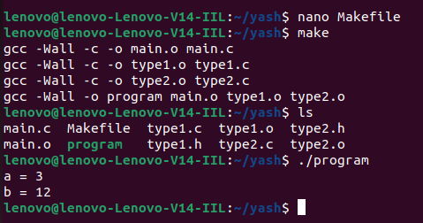

# Make-and-C

Firstly, you have to create a sample source code in C language to be compiled using Make Automation Tool.

`main.c :`
```c
#include "type1.h"
#include "type2.h"
#include <stdio.h>

int main() {
    int a = type1_add(1, 2);
    int b = type2_multiply(3, 4);
    printf("a = %d\n", a);
    printf("b = %d\n", b);
    return 0;
}
```
`type1.c :`
```c
#include "type1.h"

int type1_add(int x, int y) {
    return x + y;
}
```
`type2.c :`
```c
#include "type2.h"

int type2_multiply(int x, int y) {
    return x * y;
}
```
`type1.h :`
```c
#ifndef TYPE1_H_INCLUDED
#define TYPE1_H_INCLUDED

int type1_add(int x, int y);

#endif // TYPE1_H_INCLUDED
```
`type2.h :`
```c
#ifndef TYPE2_H_INCLUDED
#define TYPE2_H_INCLUDED

int type2_multiply(int x, int y);

#endif // TYPE2_H_INCLUDED
```
In this example, main.c includes the header files type1.h and type2.h, which declare the functions type1_add and type2_multiply, respectively. These header files are included at the top of main.c to ensure that the function prototypes are available to the main function.

The type1.c and type2.c files implement the functions declared in type1.h and type2.h, respectively. These source files include their respective header files to ensure that the function prototypes match with the actual function definitions.

To compile the above program with make, you'll need to create a Makefile in the same directory as your source code. Here's an example Makefile that corresponds to the above example:

`Makefile :`
```makefile
CC=gcc
CFLAGS=-Wall

SRC=main.c type1.c type2.c
OBJ=$(SRC:.c=.o)

all: program

program: $(OBJ)
	$(CC) $(CFLAGS) -o $@ $^

%.o: %.c
	$(CC) $(CFLAGS) -c -o $@ $<

clean:
	rm -f program $(OBJ)
  ```

Let's go through each section of this Makefile:

`CC` specifies the compiler to use (in this case, gcc).

`CFLAGS` specifies any flags you want to pass to the compiler (in this case, -Wall enables all warnings).

`SRC` lists all the source files for your program (main.c, foo.c, and bar.c).

`OBJ` specifies the corresponding object files for each source file (e.g., main.o, foo.o, and bar.o).

`all` is a special target that tells make what to build by default when you run make. In this case, it's program.

`program` is the final executable that we want to build. It depends on all the object files ($(OBJ)), and is built by linking them together using the compiler.

`%.o: %.c` is a pattern rule that tells make how to build any object file (%.o) from its corresponding source file (%.c). It compiles the source file into an object file using the compiler.

`clean` is a target that removes the program executable and all object files.


To compile the program, you can simply run `make` in the same directory as your Makefile and source code. This will build the `program` executable using the rules specified in the Makefile.

To clean up the build artifacts (i.e., the program executable and object files), you can run `make clean`.

My Output:


